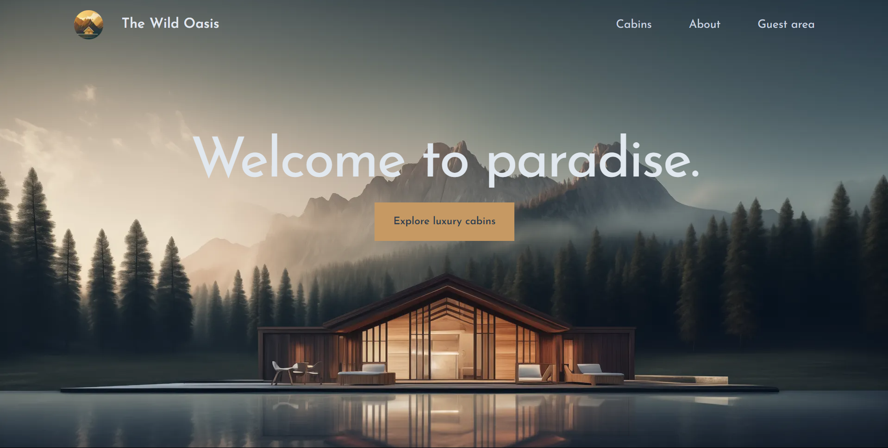

<h2 align="center">Welcome to The Wild Oasis! 🌴🏨</h2>

## Overview

The Wild Oasis Customers is a web platform for booking cabins. Users can log in with their Google accounts, submit booking requests, and track them until approval by the official company.

## 🚀 Technologies

- **🌐 Next.js**: Fullstack framework for building and rendering pages.
- **🎨 Tailwind CSS**: Responsive, utility-first CSS framework.
- **🗄️ Supabase**: Backend for database and authentication.
- **⚛️ React with Next.js**: Client-side rendering for interactive UI.
- **🔐 Auth.js**: Authentication via Google accounts.
- **📤 Server Actions**: Handle form submissions and backend logic.
- **🛠️ Heroicons**: Icons for an intuitive user interface.
- **🌍 Context API**: Global state management across the app.

## ✨ Features

### **🔐 User Authentication**

Users can log in using their Google accounts, ensuring fast and secure access. This eliminates manual account creation and simplifies user management.

### **🏕️ Booking Requests and Tracking**

The app allows users to book cabins and track their status in real-time. Users can monitor whether their booking is still pending or approved, ensuring transparency throughout the process.

### **📊 Reservations**

Provides an overview of active bookings and pending approvals. It helps users manage their reservations efficiently, displaying essential details like dates and cabin information.

### **⚙️ Profile Settings**

Users can personalize their profiles by updating personal information, This feature ensures a secure and customized user experience.

---

This app was developed as part of the Udemy course by Jonas Schmedtmann. Special thanks to Jonas for guidance throughout the course.

